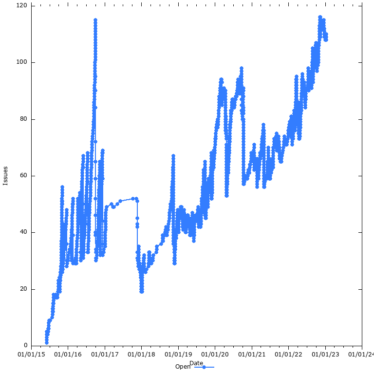
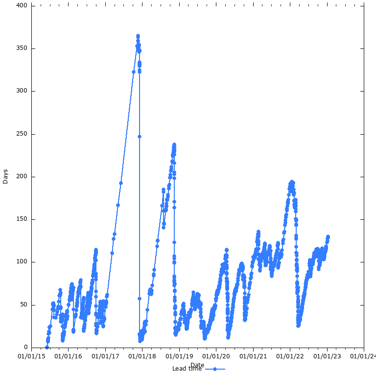
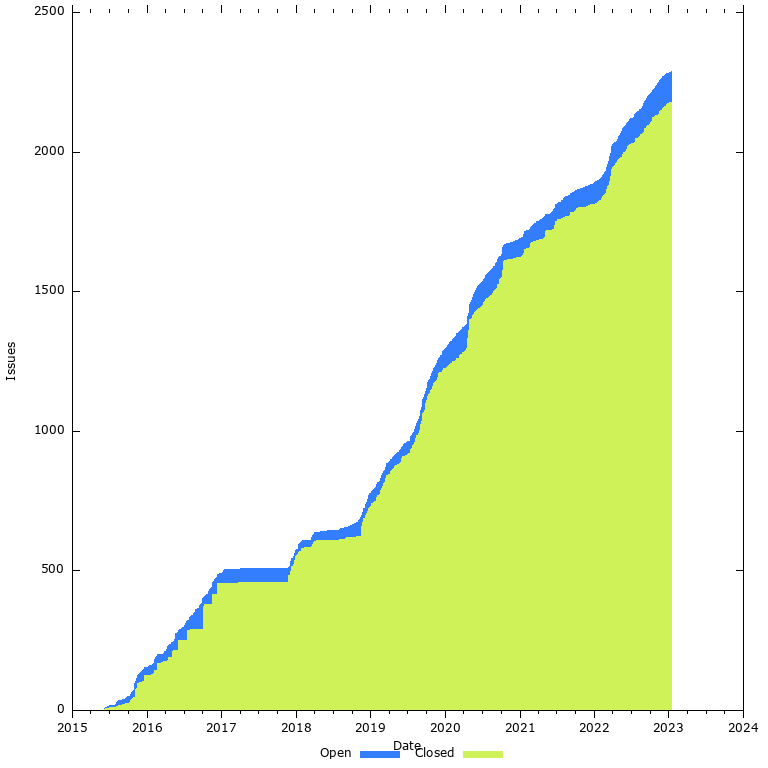

# GitHub Issue Stats (GHIS)

GHIS is a command line tool that calculates and plots stats about a GitHub project's issues:

* The number of open issues/pull requests over time
  
* Average lead time in days (time from open to closed) over time
  
* A [Cumulative Flow Diagram](https://en.wikipedia.org/wiki/Cumulative_flow_diagram)
  

## Prerequisites

You need the following software installed

* cURL
* jq
* Ruby
* gnuplot
* GitHub CLI

```bash
bundle install # install ruby gems
gh auth login
```

## Usage

Fetch a copy of GitHub issues to disk:

    scripts/fetch-issues ipfs/ipfs-desktop

Generate charts:

    make
